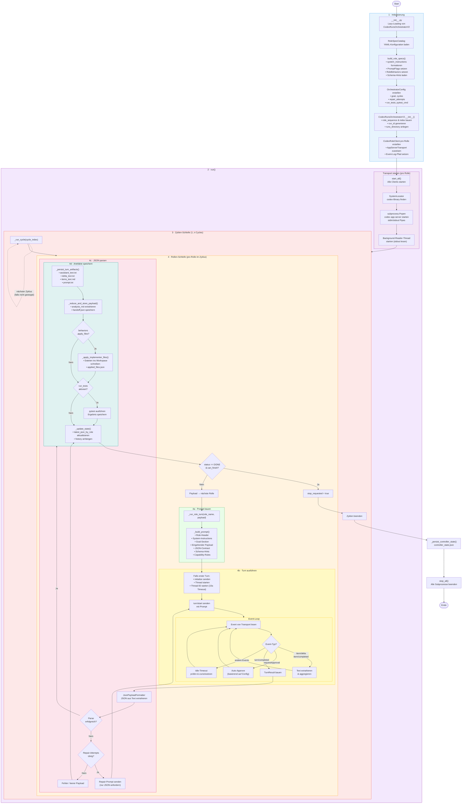
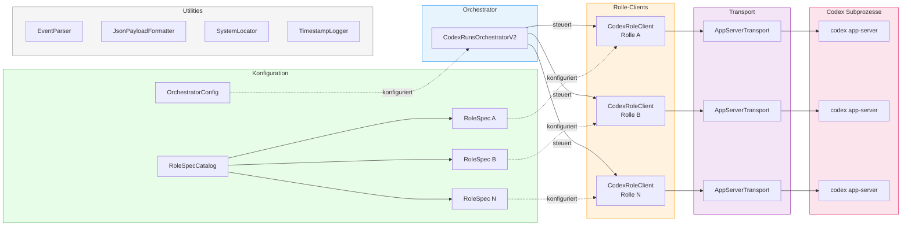
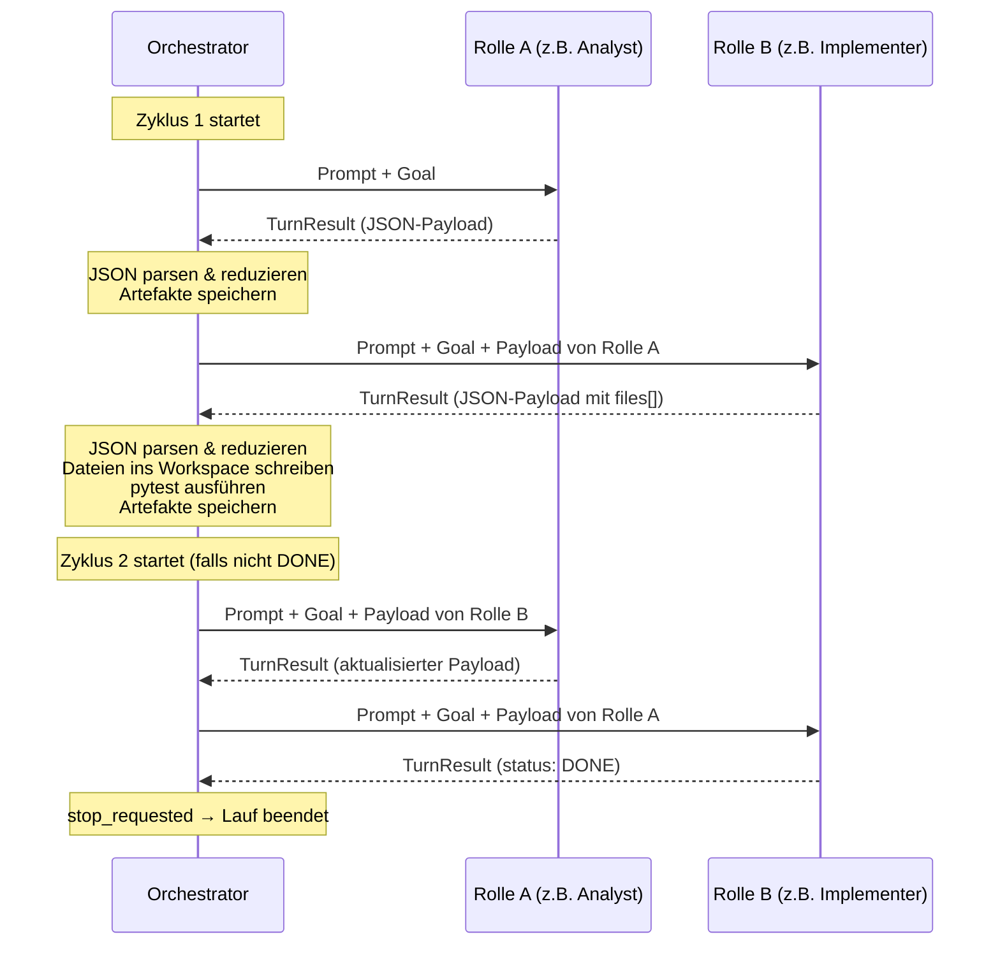

# Ablaufdiagramm – codex_multi_role

## Gesamtübersicht: Initialisierung & Lauf

```mermaid
flowchart TD
    START([Start]) --> IMPORT["__init__.py\nLazy-Loading von\nCodexRunsOrchestratorV2"]

    subgraph INIT ["1 · Initialisierung"]
        IMPORT --> CATALOG["RoleSpecCatalog\nYAML-Konfiguration laden"]
        CATALOG --> BUILD_SPECS["build_role_specs()\n• system_instructions formatieren\n• PromptFlags setzen\n• RoleBehaviors setzen\n• Schema-Hints laden"]
        BUILD_SPECS --> CONFIG["OrchestratorConfig erstellen\n• goal, cycles\n• repair_attempts\n• run_tests, pytest_cmd"]
        CONFIG --> ORCH_INIT["CodexRunsOrchestratorV2.__init__()\n• role_sequence & index bauen\n• run_id generieren\n• runs_directory anlegen"]
        ORCH_INIT --> CREATE_CLIENTS["CodexRoleClient pro Rolle erstellen\n• AppServerTransport zuweisen\n• Event-Log-Pfad setzen"]
    end

    subgraph RUN ["2 · run()"]
        CREATE_CLIENTS --> START_ALL["start_all()\nAlle Clients starten"]

        subgraph START_PROC ["Transport starten (pro Rolle)"]
            START_ALL --> FIND_BIN["SystemLocator\ncodex-Binary finden"]
            FIND_BIN --> SPAWN["subprocess.Popen\ncodex app-server starten\nstdin/stdout Pipes"]
            SPAWN --> READER["Background-Reader-Thread\nstarten (stdout lesen)"]
        end

        READER --> CYCLE_LOOP

        subgraph CYCLE_LOOP ["3 · Zyklen-Schleife (1..n Cycles)"]
            direction TB
            CYCLE_START["_run_cycle(cycle_index)"] --> ROLE_LOOP

            subgraph ROLE_LOOP ["4 · Rollen-Schleife (pro Rolle im Zyklus)"]
                direction TB
                ROLE_START["_run_role_turn(role_name, payload)"]

                subgraph PROMPT ["4a · Prompt bauen"]
                    ROLE_START --> BP["_build_prompt()\n• Role-Header\n• System-Instructions\n• Goal-Section\n• Eingehender Payload\n• JSON-Contract\n• Schema-Hints\n• Capability-Rules"]
                end

                subgraph TURN ["4b · Turn ausführen"]
                    BP --> INIT_MSG["Falls erster Turn:\n• initialize senden\n• Thread starten\n• Thread-ID warten (15s Timeout)"]
                    INIT_MSG --> SEND_TURN["turn/start senden\nmit Prompt"]
                    SEND_TURN --> EVENT_LOOP

                    subgraph EVENT_LOOP ["Event-Loop"]
                        direction TB
                        READ_EVT["Event von Transport lesen"] --> CHECK_TYPE{Event-Typ?}
                        CHECK_TYPE -->|"item/delta\nitem/completed"| EXTRACT_TEXT["Text extrahieren\n& aggregieren"]
                        CHECK_TYPE -->|"requestApproval"| APPROVAL["Auto-Approve\n(basierend auf Config)"]
                        CHECK_TYPE -->|"turn/completed"| TURN_DONE["TurnResult bauen"]
                        CHECK_TYPE -->|"andere Events"| TIMEOUT_CHECK["Idle-Timeout\nprüfen & zurücksetzen"]
                        EXTRACT_TEXT --> READ_EVT
                        APPROVAL --> READ_EVT
                        TIMEOUT_CHECK --> READ_EVT
                    end
                end

                subgraph JSON_PARSE ["4c · JSON parsen"]
                    TURN_DONE --> PARSE["JsonPayloadFormatter\nJSON aus Text extrahieren"]
                    PARSE --> PARSE_OK{Parse\nerfolgreich?}
                    PARSE_OK -->|Nein| REPAIR{Repair-Attempts\nübrig?}
                    REPAIR -->|Ja| REPAIR_PROMPT["Repair-Prompt senden\n(nur JSON anfordern)"] --> SEND_TURN
                    REPAIR -->|Nein| FAIL["Fehler / leerer Payload"]
                    PARSE_OK -->|Ja| PERSIST
                end

                subgraph PERSIST ["4d · Artefakte speichern"]
                    direction TB
                    PERSIST_TURN["_persist_turn_artifacts()\n• assistant_text.txt\n• delta_text.txt\n• items_text.md\n• prompt.txt"]
                    PERSIST_TURN --> REDUCE["_reduce_and_store_payload()\n• analysis_md extrahieren\n• handoff.json speichern"]
                    REDUCE --> APPLY{behaviors\n.apply_files?}
                    APPLY -->|Ja| WRITE_FILES["_apply_implementer_files()\n• Dateien ins Workspace\nschreiben\n• applied_files.json"]
                    APPLY -->|Nein| TEST_CHECK
                    WRITE_FILES --> TEST_CHECK
                    TEST_CHECK{run_tests\naktiviert?}
                    TEST_CHECK -->|Ja| PYTEST["pytest ausführen\nErgebnis speichern"]
                    TEST_CHECK -->|Nein| STATE_UPDATE
                    PYTEST --> STATE_UPDATE
                end

                FAIL --> STATE_UPDATE
                STATE_UPDATE["_update_state()\n• latest_json_by_role aktualisieren\n• history anhängen"]

                STATE_UPDATE --> DONE_CHECK{status == DONE\n& can_finish?}
                DONE_CHECK -->|Ja| STOP_REQ["stop_requested = true"]
                DONE_CHECK -->|Nein| NEXT_ROLE["Payload → nächste Rolle"]
            end

            STOP_REQ --> EXIT_CYCLE
            NEXT_ROLE --> ROLE_START
        end

        CYCLE_START -.->|"nächster Zyklus\n(falls nicht gestoppt)"| CYCLE_START
        EXIT_CYCLE["Zyklen beenden"]
    end

    EXIT_CYCLE --> PERSIST_STATE["_persist_controller_state()\ncontroller_state.json"]
    PERSIST_STATE --> STOP_ALL["stop_all()\nAlle Subprozesse beenden"]
    STOP_ALL --> END_NODE([Ende])

    style INIT fill:#e8f4fd,stroke:#2196F3
    style RUN fill:#f3e8fd,stroke:#9C27B0
    style CYCLE_LOOP fill:#fde8e8,stroke:#F44336
    style ROLE_LOOP fill:#fff3e0,stroke:#FF9800
    style PROMPT fill:#e8fde8,stroke:#4CAF50
    style TURN fill:#fff9c4,stroke:#FFC107
    style EVENT_LOOP fill:#fff9c4,stroke:#FFC107
    style JSON_PARSE fill:#fce4ec,stroke:#E91E63
    style PERSIST fill:#e0f2f1,stroke:#009688
    style START_PROC fill:#f3e5f5,stroke:#9C27B0
```

## Komponentendiagramm

```mermaid
graph LR
    subgraph Orchestrator
        O[CodexRunsOrchestratorV2]
    end

    subgraph Clients ["Rolle-Clients"]
        C1[CodexRoleClient\nRolle A]
        C2[CodexRoleClient\nRolle B]
        C3[CodexRoleClient\nRolle N]
    end

    subgraph Transport
        T1[AppServerTransport]
        T2[AppServerTransport]
        T3[AppServerTransport]
    end

    subgraph Processes ["Codex Subprozesse"]
        P1[codex app-server]
        P2[codex app-server]
        P3[codex app-server]
    end

    subgraph Config ["Konfiguration"]
        CAT[RoleSpecCatalog] --> RS1[RoleSpec A]
        CAT --> RS2[RoleSpec B]
        CAT --> RS3[RoleSpec N]
        OC[OrchestratorConfig]
    end

    subgraph Utils ["Utilities"]
        EP[EventParser]
        JPF[JsonPayloadFormatter]
        SL[SystemLocator]
        TL[TimestampLogger]
    end

    O -->|"steuert"| C1 & C2 & C3
    C1 --> T1 --> P1
    C2 --> T2 --> P2
    C3 --> T3 --> P3
    RS1 -.->|"konfiguriert"| C1
    RS2 -.->|"konfiguriert"| C2
    RS3 -.->|"konfiguriert"| C3
    OC -.->|"konfiguriert"| O

    style Orchestrator fill:#e8f4fd,stroke:#2196F3
    style Clients fill:#fff3e0,stroke:#FF9800
    style Transport fill:#f3e5f5,stroke:#9C27B0
    style Processes fill:#fce4ec,stroke:#E91E63
    style Config fill:#e8fde8,stroke:#4CAF50
    style Utils fill:#f5f5f5,stroke:#9E9E9E
```

## Datenfluss zwischen Rollen

```mermaid
sequenceDiagram
    participant O as Orchestrator
    participant RA as Rolle A (z.B. Analyst)
    participant RB as Rolle B (z.B. Implementer)

    Note over O: Zyklus 1 startet

    O->>RA: Prompt + Goal
    RA-->>O: TurnResult (JSON-Payload)
    Note over O: JSON parsen & reduzieren<br/>Artefakte speichern

    O->>RB: Prompt + Goal + Payload von Rolle A
    RB-->>O: TurnResult (JSON-Payload mit files[])
    Note over O: JSON parsen & reduzieren<br/>Dateien ins Workspace schreiben<br/>pytest ausführen<br/>Artefakte speichern

    Note over O: Zyklus 2 startet (falls nicht DONE)

    O->>RA: Prompt + Goal + Payload von Rolle B
    RA-->>O: TurnResult (aktualisierter Payload)
    O->>RB: Prompt + Goal + Payload von Rolle A
    RB-->>O: TurnResult (status: DONE)

    Note over O: stop_requested → Lauf beendet
```
