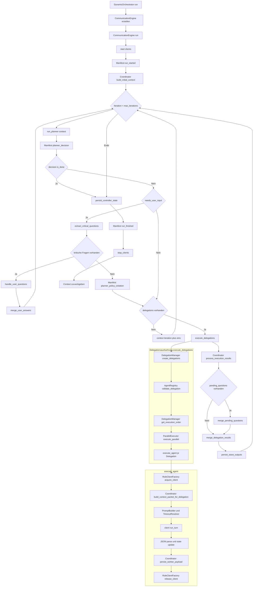
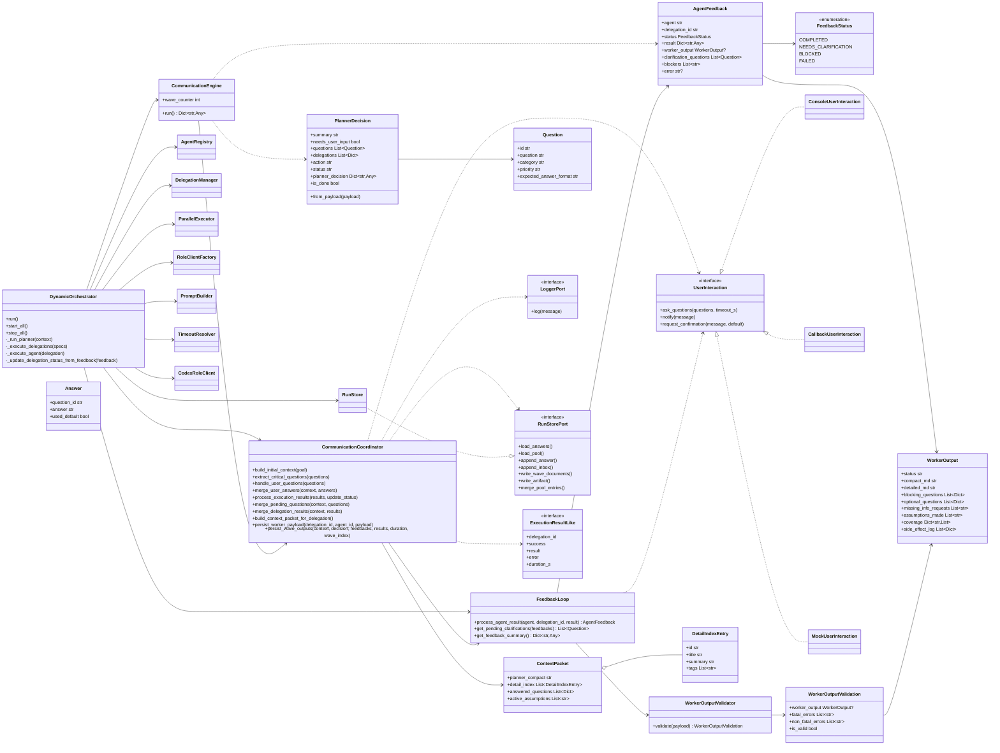

# Communication Architektur Diagramme

## Flussdiagramm

```mermaid
flowchart TD
    A["DynamicOrchestrator run"] --> B["CommunicationEngine erstellen"]
    B --> C["CommunicationEngine run"]

    C --> D["start clients"]
    D --> E["Manifest run_started"]
    E --> F["Coordinator build_initial_context"]

    F --> G{"Iteration &lt; max_iterations"}
    G --> H["run_planner context"]
    H --> I["Manifest planner_decision"]
    I --> J{"decision is_done"}

    J -- "Ja" --> Z1["persist_controller_state"]
    J -- "Nein" --> K{"needs_user_input"}

    K -- "Ja" --> K1["extract_critical_questions"]
    K1 --> K2{"kritische Fragen vorhanden"}
    K2 -- "Ja" --> K3["handle_user_questions"]
    K3 --> K4["merge_user_answers"]
    K4 --> G
    K2 -- "Nein" --> K5["Manifest planner_policy_violation"]
    K5 --> L

    K -- "Nein" --> L{"delegations vorhanden"}
    L -- "Nein" --> L1["context iteration plus eins"]
    L1 --> G

    L -- "Ja" --> M["execute_delegations"]
    M --> N["Coordinator process_execution_results"]
    N --> O{"pending_questions vorhanden"}
    O -- "Ja" --> O1["merge_pending_questions"]
    O -- "Nein" --> P
    O1 --> P["merge_delegation_results"]
    P --> Q["persist_wave_outputs"]
    Q --> G

    G -- "Ende" --> Z1
    Z1 --> Z2["Manifest run_finished"]
    Z2 --> Z3["stop_clients"]
    Z3 --> Z4["Context zurueckgeben"]

    subgraph X["Delegationsausfuehrung execute_delegations"]
        X1["DelegationManager create_delegations"]
        X2["AgentRegistry validate_delegation"]
        X3["DelegationManager get_execution_order"]
        X4["ParallelExecutor execute_parallel"]
        X5["execute_agent je Delegation"]

        X1 --> X2 --> X3 --> X4 --> X5
    end

    M --> X1

    subgraph Y["execute_agent"]
        Y1["RoleClientFactory acquire_client"]
        Y2["Coordinator build_context_packet_for_delegation"]
        Y3["PromptBuilder und TimeoutResolver"]
        Y4["client run_turn"]
        Y5["JSON parse und state update"]
        Y6["Coordinator persist_worker_payload"]
        Y7["RoleClientFactory release_client"]

        Y1 --> Y2 --> Y3 --> Y4 --> Y5 --> Y6 --> Y7
    end

    X5 --> Y1
```

## Klassendiagramm

```mermaid
classDiagram
    direction LR

    class DynamicOrchestrator {
      +run()
      +start_all()
      +stop_all()
      -_run_planner(context)
      -_execute_delegations(specs)
      -_execute_agent(delegation)
      -_update_delegation_status_from_feedback(feedback)
    }

    class CommunicationEngine {
      +run() Dict~str,Any~
      +wave_counter int
    }

    class CommunicationCoordinator {
      +build_initial_context(goal)
      +extract_critical_questions(questions)
      +handle_user_questions(questions)
      +merge_user_answers(context, answers)
      +process_execution_results(results, update_status)
      +merge_pending_questions(context, questions)
      +merge_delegation_results(context, results)
      +build_context_packet_for_delegation()
      +persist_worker_payload(delegation_id, agent_id, payload)
      +persist_wave_outputs(context, decision, feedbacks, results, duration, wave_index)
    }

    class PlannerDecision {
      +summary str
      +needs_user_input bool
      +questions List~Question~
      +delegations List~Dict~
      +action str
      +status str
      +planner_decision Dict~str,Any~
      +is_done bool
      +from_payload(payload)
    }

    class FeedbackLoop {
      +process_agent_result(agent, delegation_id, result) AgentFeedback
      +get_pending_clarifications(feedbacks) List~Question~
      +get_feedback_summary() Dict~str,Any~
    }

    class AgentFeedback {
      +agent str
      +delegation_id str
      +status FeedbackStatus
      +result Dict~str,Any~
      +worker_output WorkerOutput?
      +clarification_questions List~Question~
      +blockers List~str~
      +error str?
    }

    class FeedbackStatus {
      <<enumeration>>
      COMPLETED
      NEEDS_CLARIFICATION
      BLOCKED
      FAILED
    }

    class WorkerOutputValidator {
      +validate(payload) WorkerOutputValidation
    }

    class WorkerOutputValidation {
      +worker_output WorkerOutput?
      +fatal_errors List~str~
      +non_fatal_errors List~str~
      +is_valid bool
    }

    class WorkerOutput {
      +status str
      +compact_md str
      +detailed_md str
      +blocking_questions List~Dict~
      +optional_questions List~Dict~
      +missing_info_requests List~str~
      +assumptions_made List~str~
      +coverage Dict~str,List~
      +side_effect_log List~Dict~
    }

    class ContextPacket {
      +planner_compact str
      +detail_index List~DetailIndexEntry~
      +answered_questions List~Dict~
      +active_assumptions List~str~
    }

    class DetailIndexEntry {
      +id str
      +title str
      +summary str
      +tags List~str~
    }

    class Question {
      +id str
      +question str
      +category str
      +priority str
      +expected_answer_format str
    }

    class Answer {
      +question_id str
      +answer str
      +used_default bool
    }

    class UserInteraction {
      <<interface>>
      +ask_questions(questions, timeout_s)
      +notify(message)
      +request_confirmation(message, default)
    }

    class ConsoleUserInteraction
    class CallbackUserInteraction
    class MockUserInteraction

    class LoggerPort {
      <<interface>>
      +log(message)
    }

    class RunStorePort {
      <<interface>>
      +load_answers()
      +load_pool()
      +append_answer()
      +append_inbox()
      +write_wave_documents()
      +write_artifact()
      +merge_pool_entries()
    }

    class ExecutionResultLike {
      <<interface>>
      +delegation_id
      +success
      +result
      +error
      +duration_s
    }

    class RunStore
    class AgentRegistry
    class DelegationManager
    class ParallelExecutor
    class RoleClientFactory
    class PromptBuilder
    class TimeoutResolver
    class CodexRoleClient

    DynamicOrchestrator --> CommunicationEngine
    DynamicOrchestrator --> CommunicationCoordinator
    DynamicOrchestrator --> FeedbackLoop
    DynamicOrchestrator --> AgentRegistry
    DynamicOrchestrator --> DelegationManager
    DynamicOrchestrator --> ParallelExecutor
    DynamicOrchestrator --> RoleClientFactory
    DynamicOrchestrator --> PromptBuilder
    DynamicOrchestrator --> TimeoutResolver
    DynamicOrchestrator --> CodexRoleClient
    DynamicOrchestrator --> RunStore

    CommunicationEngine --> CommunicationCoordinator
    CommunicationEngine ..> PlannerDecision
    CommunicationEngine ..> AgentFeedback

    CommunicationCoordinator --> FeedbackLoop
    CommunicationCoordinator ..> UserInteraction
    CommunicationCoordinator ..> LoggerPort
    CommunicationCoordinator ..> RunStorePort
    CommunicationCoordinator ..> ExecutionResultLike
    CommunicationCoordinator --> ContextPacket

    ContextPacket o-- DetailIndexEntry

    FeedbackLoop --> WorkerOutputValidator
    FeedbackLoop --> AgentFeedback
    FeedbackLoop ..> UserInteraction

    AgentFeedback --> FeedbackStatus
    AgentFeedback --> WorkerOutput

    WorkerOutputValidator --> WorkerOutputValidation
    WorkerOutputValidation --> WorkerOutput

    PlannerDecision --> Question

    UserInteraction <|.. ConsoleUserInteraction
    UserInteraction <|.. CallbackUserInteraction
    UserInteraction <|.. MockUserInteraction

    RunStore ..|> RunStorePort
```
